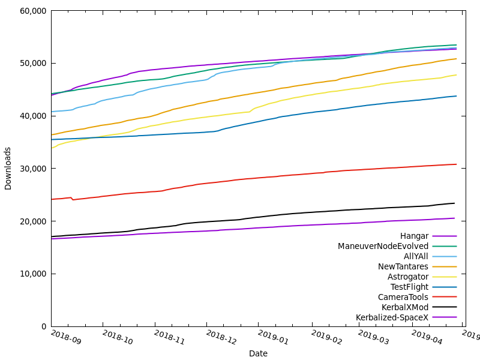
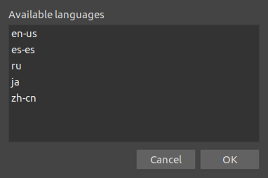
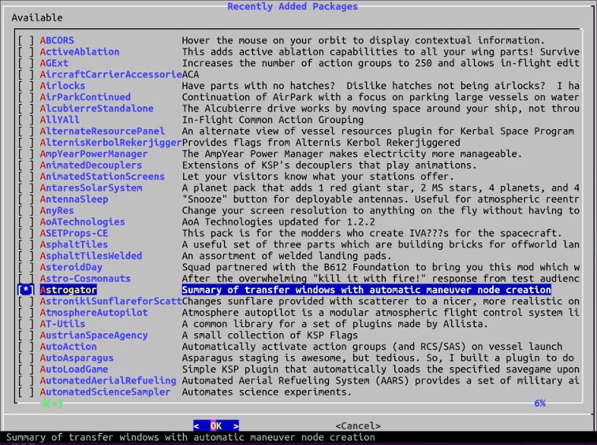
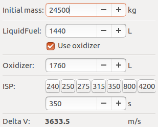

# HebaruSan's KSP Tools

Command line utilities for automating common tasks related to [Kerbal Space Program](http://kerbalspaceprogram.com/).

The contents of this repository are released into the public domain.

## ckan_download_count_graph.py and plot_counts.gnuplot

Extracts download counts from CKAN-meta for the given identifiers and plots them.

```sh
ckan_download_count_graph.py Hangar ManeuverNodeEvolved AllYAll NewTantares Astrogator TestFlight CameraTools KerbalXMod Kerbalized-SpaceX
```



## ksp_set_locale



Edits the language setting with a menu.

## ksp_save_dv

Parses a Kerbal Space Program save file and prints the delta V of each active craft. See code comments for known limitations.

```
$ ksp_save_dv persistent.sfs
NOTE: This tool does not account for staging or atmospheric ISP variation!
     Mass         LF         Ox        ISP      LF Δv   Monoprop     RCS Δv
2514060.0        0.0        0.0      340.0        0.0      643.0        2.4  Roid Wrangler 2.0
    938.9        0.0        0.0        0.0        0.0        9.7       99.7  Nuclear Venturer 1 Ship
 257163.3     4005.9     4896.1      315.0      587.1        0.0        0.0  Space K - ITS "Heart of Gold"
  49106.2     1152.0     1408.0      240.0      710.8       70.0       13.5  Gilly Observation Post 1
  39345.0     2754.9     3367.1      350.0     5165.8       30.0        7.2  Lacus Exterioris 1
  15616.3      316.9        0.0      240.0        0.0        7.5        4.5  Thiokol Orbiter 1.2.2
 310671.7    21954.8    26833.6      350.0     5279.2        0.0        0.0  Fargoer 1.1
 299717.3    15524.3    18974.1      340.0     2857.1        0.0        0.0  Hyperbolic Explorer 1
```

## ksp_engine_isps

Given the location of a Kerbal Space Program installation (defaults to default Steam library on Linux), parses the parts files and prints a table of the specific impulses of all stock engines in Perl hash format. Intended for updating `ksp_save_dv` above.

```
$ ksp_engine_isps
        'sepMotor1'     => 154, # solidBoosterSep
        'solidBooster_sm'       => 165, # solidBoosterRT-5
        'LaunchEscapeSystem'    => 180, # launchEscapeSystem
        ...
```

## ckan_registry

Print the path to the CKAN registry file of the current default installation.

```
$ ckan_registry
/home/me/Games/KSP-1.2.2/CKAN/registry.json
```

## ckan_abstract

Given a mod name, extracts the long form description of it from the [CKAN](http://forum.kerbalspaceprogram.com/index.php?/topic/90246-the-comprehensive-kerbal-archive-network-ckan-package-manager-v1180-19-june-2016/) registry file.

```
$ ckan_abstract Astrogator
Summary of transfer windows with automatic maneuver node creation
```

## ckan_updates

A simplistic text UI for CKAN based on the `dialog` utility. Only handles updates and installs.



## wget_ckan

Downloads a version of CKAN and updates a symbolic link to point to the download.

## deltav.py

A delta V calculator with a graphical interface, for hovering over the game when your mods are not yet updated.



## deltav

Prints the delta V of a craft by applying the [Tsiolkovsky rocket equation](https://en.wikipedia.org/wiki/Tsiolkovsky_rocket_equation), given command line parameters:

1. Current mass in kilograms
2. Oxidizer in in-game units
3. LiquidFuel in in-game units
4. Specific impulse in seconds

## dv-lvn-1.0

Same as `deltav` above but ignores oxidizer. Parameters:

1. Current mass in kilograms
2. LiquidFuel in in-game units
3. Specific impulse in seconds
